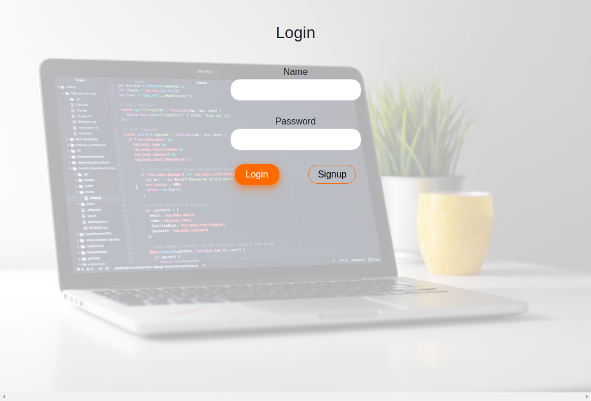
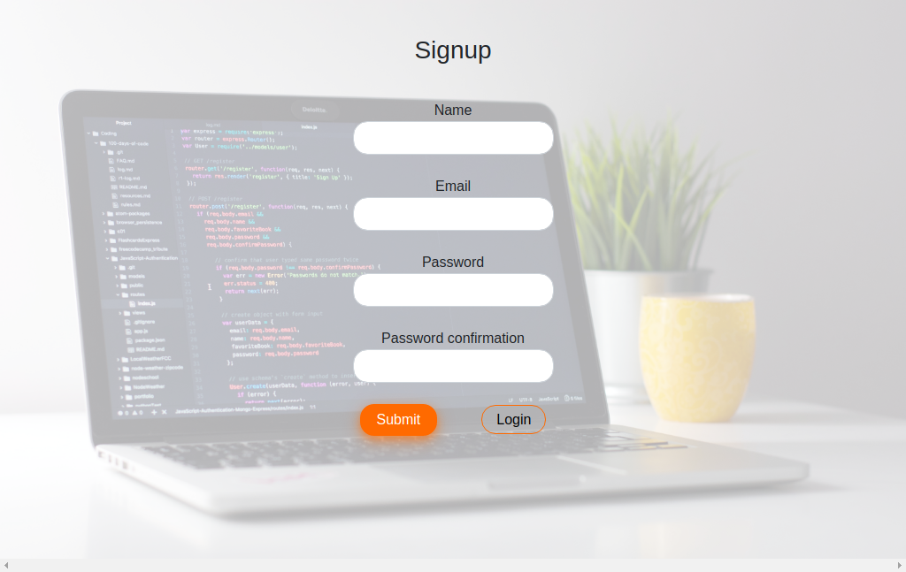
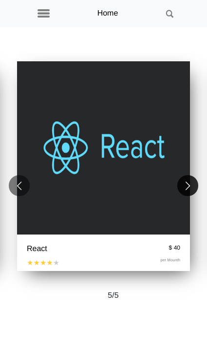
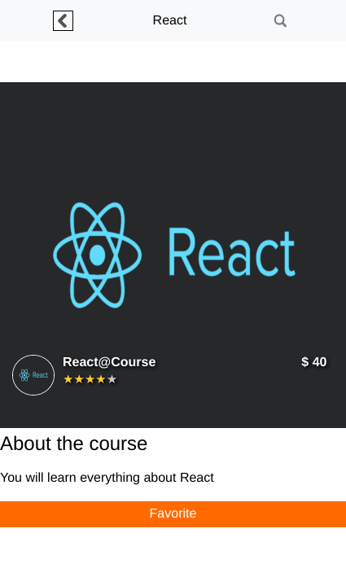
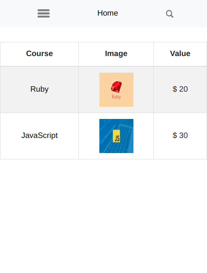

<h1 align="center">Find your course</h1>

## Table of contents

  - [About](#about)
  - [The App](#the-app)
  - [Technologies used](#technologies-used)
  - [Future work](#future-work)
  - [Contact](#contact)
  - [Acknowledgments](#acknowledgments)
  - [Show your support](#show-your-support)

## About

The project's goal was to build a mobile web app based on a <a href="https://www.behance.net/gallery/37706679/Circle-(Landing-page-Dashboard-Mobile-App)"> find your house app.</a> 
Back-end: REST API with Ruby on Rails. 
Front-end: React and Redux.

The project's assignment can be seen <a href="https://www.notion.so/Final-Capstone-Project-Find-Your-House-9a424802e7dc48eb8ef40e2ac09397d1"> here</a>

The back-end repository can be found <a href="https://github.com/FelipeEnne/api_find_your_course"> here</a>

<a href="https://eloquent-euclid-648aac.netlify.app/">Live version</a>

## The App

<a href="https://www.loom.com/share/8282162242cd4c3685ff5444903814f7">Screenshots and Walkthrough</a>

### Login Page

Is a simple login page where the user can enter the App.

### Signup Page

User can create an account.

### Home Page

The home page is a list of courses and the user can select a specific course to find out more and favorite it.

### Info Page

On this page the user has more information about the course and can favorite it.

### Favorite Page

Shows the courses the user has favored.

#### Local usage

To use this API locally, follow the steps:

* Clone the repository
* Open your terminal and navigate to repository's folder
* Run:
  * npm install
  * npm start

## Technologies used

* JavaScript
* A bit of HTML and CSS
* React
* Redux
* GitHub

## Future work

* Implement the search bar
* Implement the warnings

## Contact
Felipe Enne Mendes Ribeiro
* Email - felipeenne@gmail.com
* <a href="https://www.linkedin.com/in/felipe-enne/" target="_blank">LinkedIn</a>
* <a href="https://felipeenne.com/" target="_blank">Portfolio</a>

## Acknowledgements

- [Microverse](https://www.microverse.org/)

## Show your support

Give a ⭐️ if you like this project!

