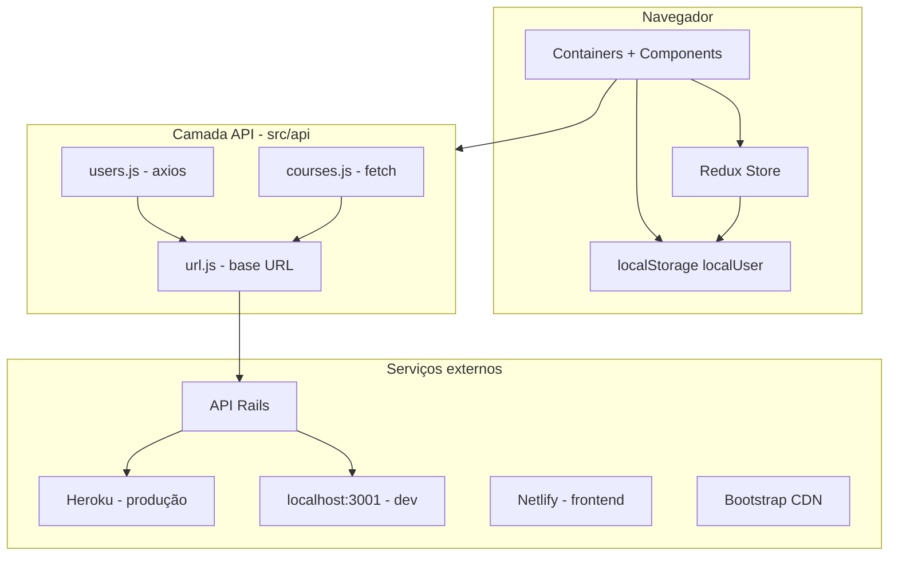
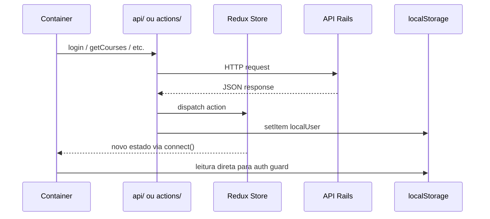

# Arquitetura — Find Your Course

## Visão geral

O projeto segue uma arquitetura de **SPA frontend** que consome uma **API REST externa** (Ruby on Rails). Não há backend, workers nem banco de dados neste repositório.

---

## Camadas do frontend

### 1. Apresentação (`containers/` + `components/`)

- **Containers:** páginas com lógica de negócio, `connect()` do Redux e chamadas diretas à API.
- **Components:** UI reutilizável sem lógica de negócio complexa (Navbar, Loading, tabelas).

### 2. Estado (`actions/` + `reducers/`)

- Redux clássico com `combineReducers` e middleware `redux-thunk`.
- Três slices de estado: `user`, `userSigned`, `courses`.
- O reducer `user` inicializa lendo `localStorage` no carregamento do módulo (side-effect na importação).

### 3. Comunicação (`api/`)

- `url.js` — URL base da API.
- `users.js` — login, cadastro e PATCH de favoritos (axios).
- `courses.js` — GET de cursos via `fetch` + dispatch de actions de loading/success/error.

### 4. Persistência local

- `localStorage` com chave `localUser` armazena sessão e favoritos.
- Inicializado em `src/index.js` se não existir.

---

## Frontend, backend, API e banco

| Camada | Onde está | Tecnologia |
|--------|-----------|------------|
| Frontend | Este repositório | React 16 + CRA |
| API REST | Repositório externo | Ruby on Rails |
| Banco de dados | Backend Rails | A confirmar (provável PostgreSQL no Heroku) |
| Deploy frontend | Netlify | A confirmar se ativo |
| Deploy API | Heroku | `protected-beyond-23220.herokuapp.com` — A confirmar se ativo |

---

## Comunicação entre módulos

**Observação:** containers leem `localStorage` diretamente para verificar `remember`, além de usar Redux. Isso cria duas fontes de verdade para autenticação.

---

## Onde ficam as regras de negócio

| Regra | Localização atual |
|-------|-------------------|
| Autenticação / sessão | `containers/Login.js`, `reducers/user.js`, `localStorage` |
| Cadastro | `containers/Signup.js`, `api/users.js` |
| Listagem de cursos | `api/courses.js`, `containers/Home.js` |
| Favoritar / desfavoritar | `containers/Info.js` (lógica CSV local + PATCH na API) |
| Listar favoritos | `containers/Favorite.js` (cruzamento local com lista de cursos) |
| Proteção de rotas | Cada container verifica `localUser.remember` manualmente |

Não existe camada de serviços (`services/`) nem hooks customizados.

---

## Integrações externas

| Integração | Uso |
|------------|-----|
| API Rails (Heroku) | Dados de usuários e cursos |
| Bootstrap CDN | CSS adicional em `public/index.html` |
| Netlify | Hospedagem do build de produção (referência no README) |

---

## Problemas conhecidos da arquitetura

1. **Auth insegura:** login via `GET` com senha na query string; sem JWT ou sessão server-side no frontend.
2. **Dupla fonte de verdade:** Redux + `localStorage` para estado do usuário.
3. **HTTP inconsistente:** axios para usuários, `fetch` para cursos.
4. **Sem variáveis de ambiente:** URL da API hardcoded em `src/api/url.js`.
5. **Sem route guards:** proteção de rota duplicada em cada container.
6. **Nomenclatura mista:** actions/reducers usam "products" e "courses" para a mesma entidade.
7. **Código morto:** `userSigned` reducer e `getCoursesAction` praticamente sem uso.
8. **Side-effect no reducer:** `user.js` lê `localStorage` na importação do módulo.

---

## Sugestões futuras (sem alterar código agora)

- Introduzir `REACT_APP_API_URL` via `.env` para configurar a API por ambiente.
- Criar componente `PrivateRoute` centralizando verificação de autenticação.
- Unificar cliente HTTP (axios ou fetch) em um único módulo.
- Migrar favoritos de nomes CSV para IDs de cursos.
- Adotar autenticação com token (JWT ou sessão) em vez de credenciais na URL.
- Considerar migração gradual para React hooks (`useSelector`, `useDispatch`) em novos componentes.
- Documentar e versionar o contrato da API junto com o backend Rails.
