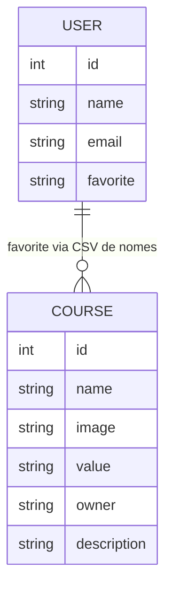

# Banco de Dados — Find Your Course

## Importante

**Este repositório não contém banco de dados, ORM, migrations nem seeds.**

Toda persistência de dados ocorre no **backend Ruby on Rails**, em repositório separado:

- [api_find_your_course](https://github.com/FelipeEnne/api_find_your_course)

O frontend apenas consome a API REST e armazena sessão localmente no `localStorage` do navegador.

---

## Tipo de banco (backend)

| Aspecto | Valor |
|---------|-------|
| SGBD provável | PostgreSQL (padrão em deploy Heroku com Rails) |
| ORM (backend) | Active Record (Rails) |
| Confirmação | **A confirmar** — verificar `database.yml` e migrations no repo backend |

---

## Models inferidos do contrato da API

Com base nas chamadas HTTP do frontend, os models prováveis são:

### User

| Campo | Tipo inferido | Observação |
|-------|---------------|--------------|
| `id` | integer | Retornado no login e usado no PATCH |
| `name` | string | Login e exibição |
| `email` | string | Cadastro |
| `password` | string | Enviado no cadastro; login usa GET com query string |
| `password_confirmation` | string | Apenas no cadastro |
| `favorite` | string | CSV de **nomes** de cursos favoritos |

**Dados sensíveis:** senhas trafegam na API. O login usa `GET /login?name=&password=` — método inseguro que pode expor credenciais em logs e histórico.

### Course

| Campo | Tipo inferido | Uso no frontend |
|-------|---------------|-----------------|
| `id` | integer | Rota e identificação |
| `name` | string | Título, favoritos (por nome) |
| `image` | string (URL) | Imagens no carrossel e detalhe |
| `value` | number/string | Preço mensal |
| `starts` | number | Avaliação em estrelas (possível typo de `stars`) |
| `owner` | string | Responsável pelo curso |
| `description` | text | Descrição na página Info |

Schema exato (tipos, constraints, índices): **A confirmar** no backend.

---

## Relacionamentos

Com base no uso no frontend:



**Observação:** favoritos não usam tabela de junção nem foreign keys no frontend — o campo `favorite` do usuário é uma string com nomes separados por vírgula. O modelo relacional real no backend: **A confirmar**.

---

## Migrations

| Local | Status |
|-------|--------|
| Este repositório | **Não possui** |
| Backend Rails | **A confirmar** — pasta `db/migrate/` no repo `api_find_your_course` |

---

## Seeds

| Local | Status |
|-------|--------|
| Este repositório | **Não possui** |
| Backend Rails | **A confirmar** — arquivo `db/seeds.rb` no repo backend |

---

## Persistência no frontend (não é banco)

| Armazenamento | Chave | Conteúdo |
|---------------|-------|----------|
| `localStorage` | `localUser` | Sessão e favoritos em JSON |

Isso **não substitui** o banco do backend — é cache local no navegador.

---

## Como completar esta documentação

1. Clone o repositório backend:
   ```bash
   git clone https://github.com/FelipeEnne/api_find_your_course
   ```
2. Revise `db/schema.rb` ou migrations em `db/migrate/`.
3. Documente tabelas, índices e relacionamentos reais.
4. Atualize este arquivo com informações confirmadas.

---

## Comandos de banco (backend — A confirmar)

```bash
# Exemplos típicos Rails — validar no README do backend
rails db:create
rails db:migrate
rails db:seed
rails db:console
```

Não execute migrations neste repositório frontend — elas pertencem ao backend.
