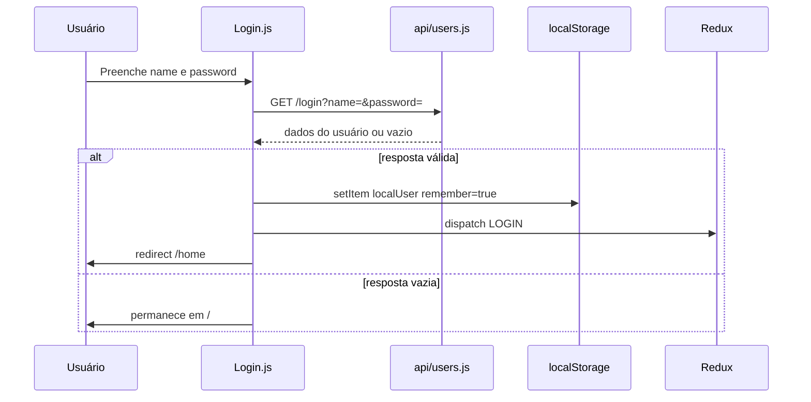
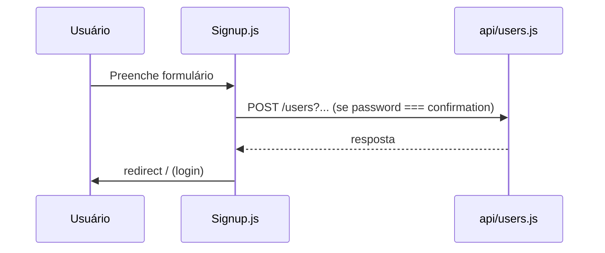
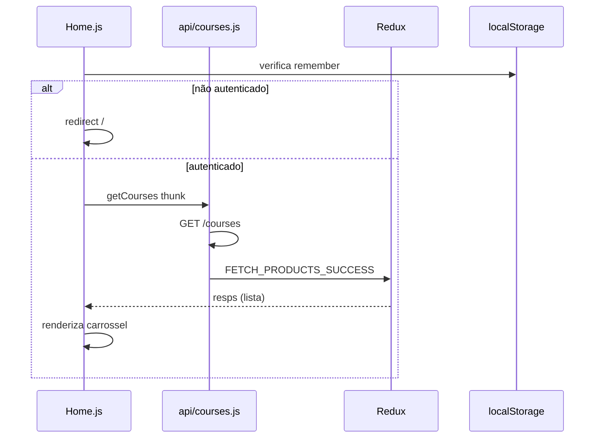
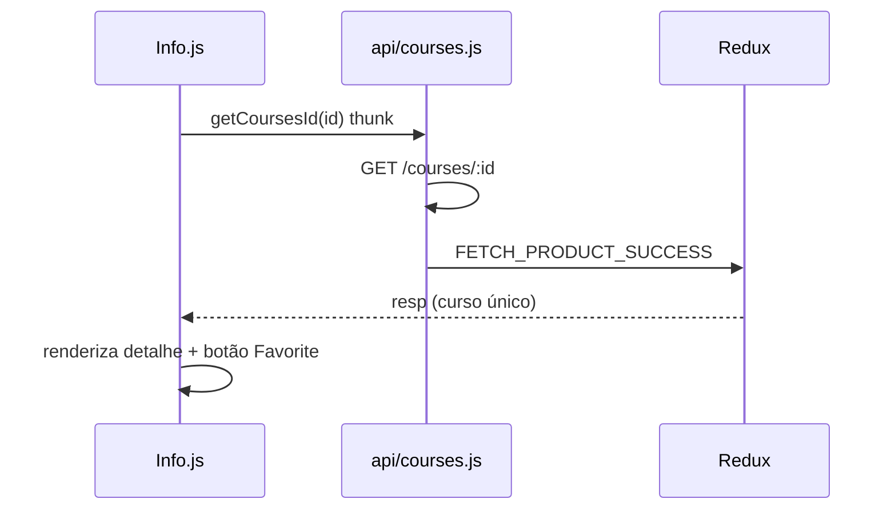
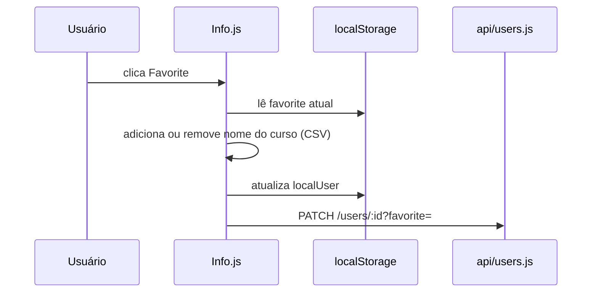
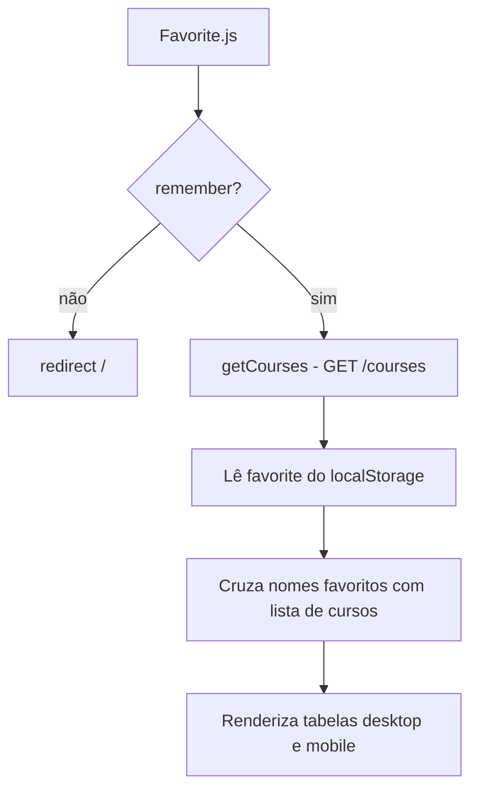
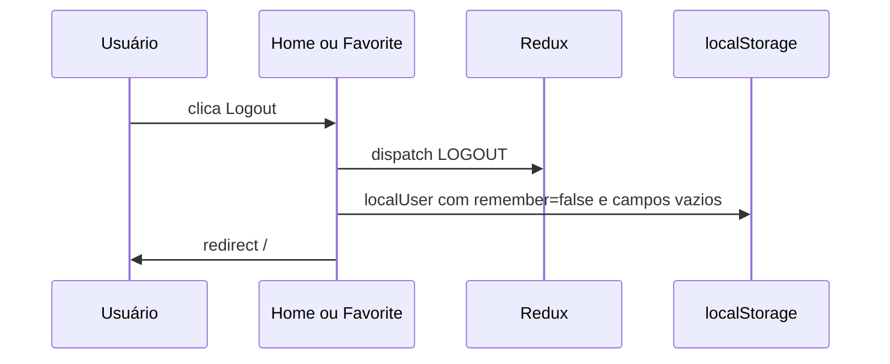
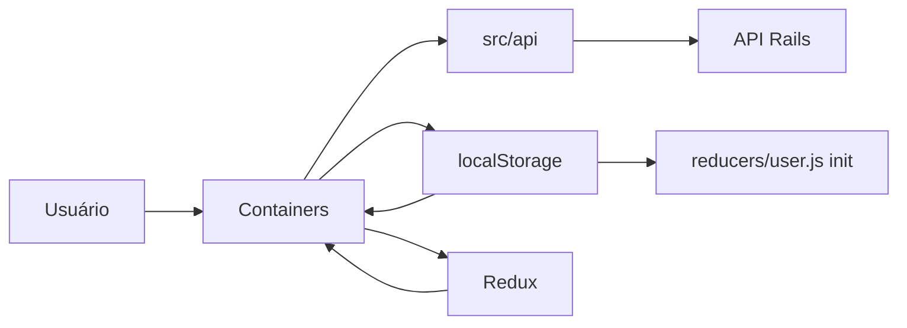

# Fluxos — Find Your Course

Documentação dos principais fluxos de negócio e chamadas de API.

---

## Formato do `localStorage`

Chave: `localUser`

```json
{
  "id": 1,
  "name": "nome_do_usuario",
  "email": "email@exemplo.com",
  "favorite": "Curso A,Curso B",
  "remember": true
}
```

| Campo | Tipo | Descrição |
|-------|------|-----------|
| `id` | number | ID do usuário na API |
| `name` | string | Nome de login |
| `email` | string | E-mail |
| `favorite` | string | Nomes de cursos favoritos separados por vírgula (CSV) |
| `remember` | boolean | `true` = sessão ativa; `false` = deslogado |

Inicializado em `src/index.js` com valores vazios se não existir.

---

## Endpoints da API

Base URL: definida em `src/api/url.js` (Heroku ou `localhost:3001`).

| Método | Endpoint | Parâmetros | Uso |
|--------|----------|------------|-----|
| GET | `/login` | `name`, `password` (query string) | Login |
| POST | `/users` | `name`, `email`, `password`, `password_confirmation`, `favorite` (query string) | Cadastro |
| PATCH | `/users/:id` | `favorite` (query string) | Atualizar favoritos |
| GET | `/courses` | — | Listar cursos |
| GET | `/courses/:id` | — | Detalhe de um curso |

**Atenção:** credenciais trafegam na query string no login — risco de segurança.

---

## Campos do curso (resposta da API)

Campos usados na UI:

| Campo | Uso |
|-------|-----|
| `id` | Identificador e rota `/info/:id` |
| `name` | Título do curso |
| `image` | URL da imagem |
| `value` | Preço mensal |
| `starts` | Avaliação em estrelas (typo no backend — provável `stars`) |
| `owner` | Nome do responsável |
| `description` | Texto descritivo |

---

## Fluxo: Login / Autenticação



**Proteção de sessão existente:** se `localUser.remember === true`, Login redireciona direto para `/home`.

**Arquivos:** `src/containers/Login.js`, `src/api/users.js`, `src/actions/user.js`, `src/reducers/user.js`

---

## Fluxo: Cadastro (Signup)



**Observações:**

- Não há login automático após cadastro.
- Se `user.logged` no Redux, redireciona para `/home`.
- Validação de senha feita apenas no frontend (`password === confirmation`).

**Arquivos:** `src/containers/Signup.js`, `src/api/users.js`

---

## Fluxo: Listagem de cursos (Home)



**Arquivos:** `src/containers/Home.js`, `src/api/courses.js`, `src/actions/loader.js`, `src/reducers/courses.js`

---

## Fluxo: Detalhe do curso (Info)



**Arquivos:** `src/containers/Info.js`, `src/api/courses.js`

---

## Fluxo: Favoritar / Desfavoritar



**Lógica:**

- Favoritos armazenados como **nomes de cursos** em string CSV, não IDs.
- Funções `findFavorite` e `findFavoriteID` manipulam o array localmente.
- O botão não alterna visualmente entre Favorite/Unfavorite de forma confiável (variável local `buttonFavorite` não re-renderiza).

**Arquivos:** `src/containers/Info.js`, `src/api/users.js`

---

## Fluxo: Listar favoritos (Favorite)



**Arquivos:** `src/containers/Favorite.js`, `src/components/FavoriteTable.js`, `src/components/FavoriteTableMobile.js`

---

## Fluxo: Logout



**Arquivos:** `src/containers/Home.js`, `src/containers/Favorite.js`, `src/actions/user.js`

---

## Proteção de rotas

Não há `PrivateRoute` ou middleware de rota. Cada container protegido faz:

```javascript
const info = JSON.parse(localStorage.localUser);
if (!info.remember) {
  history.push('/');
}
```

Containers com essa verificação: `Home`, `Info`, `Favorite`.

---

## Integrações e features pendentes

| Feature | Status |
|---------|--------|
| Barra de busca | Input **desabilitado** em Navbar (`id="input-fillter"`) |
| Warnings / notificações | Mencionado no README como future work; libs instaladas (`react-toastify`, `react-notifications-component`) com uso limitado ou ausente — **A confirmar** |
| Carrossel alternativo | `@brainhubeu/react-carousel` no package.json — **A confirmar** se ainda é usado |

---

## Fluxo de dados geral


